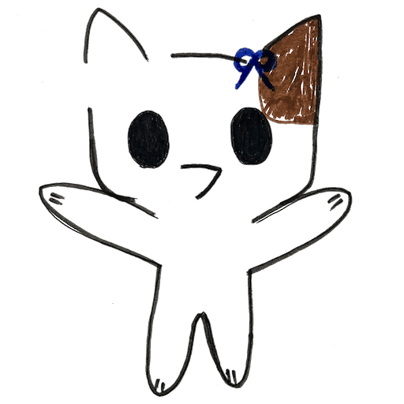
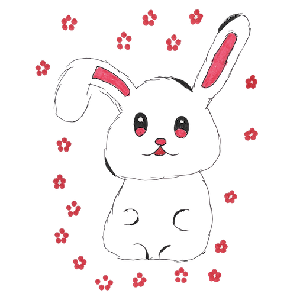
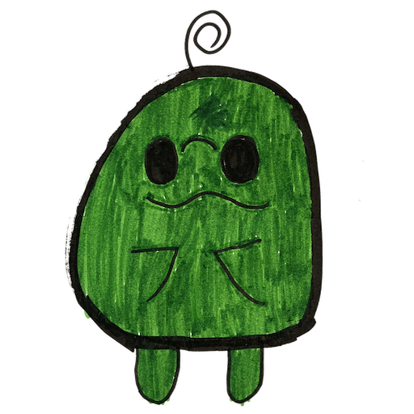
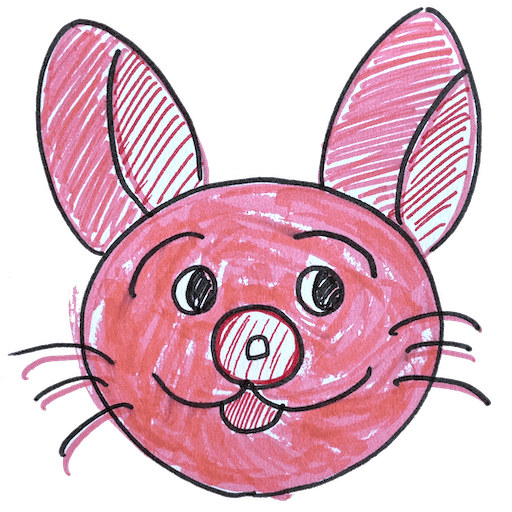

# progsaturday

プログラミング関連プロジェクト向けのキャラクターイラスト集です。

## キャラクター

| きたちゃん (Kitachan) | ゆめぴょん (Yumepyon) |
| :---: | :---: |
|  |  |

| えだまめ (Edamame) | うさぎまん (Usagiman) |
| :---: | :---: |
|  |  |

## 特別キャラクター

このキャラクターは特別なコントリビューターによって制作されました。

**たこだるま (Takodaruma)** by [自然派たこ焼き　たこだるま(@takodaruma111)](https://www.instagram.com/takodaruma111/)

## 利用方法

本リポジトリの以下のPNG画像をプロジェクトでご利用いただけます。ライセンスの要件に従ってクレジットを表記してください。

- `kitachan_b.png`
- `yumepyon.png`
- `edamame.png`
- `usagiman_c.png`
- `takodaruma.png`

## ライセンス

CC BY Code for FUKUI
